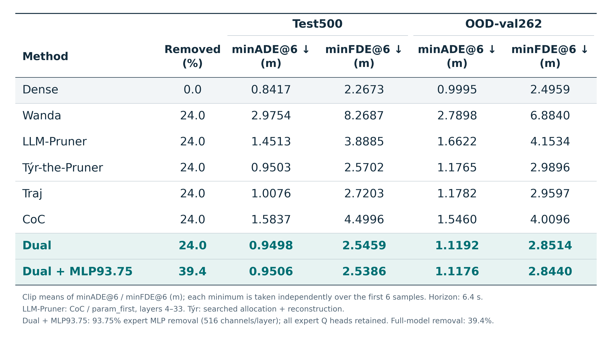
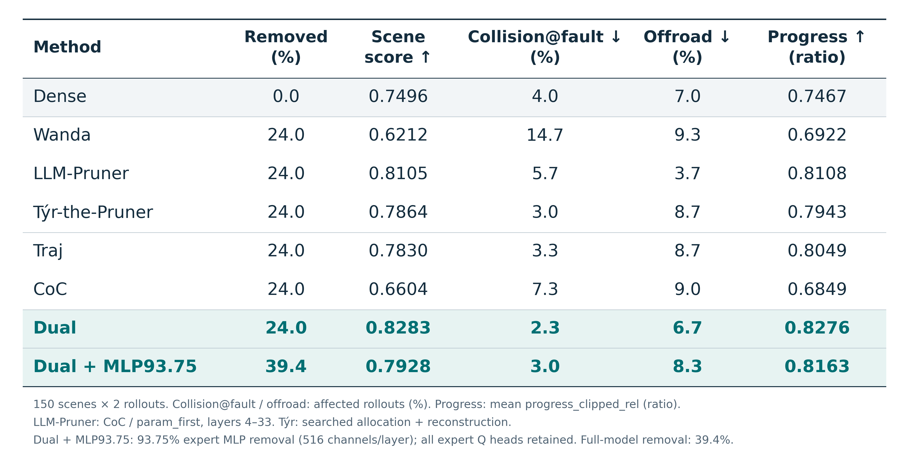
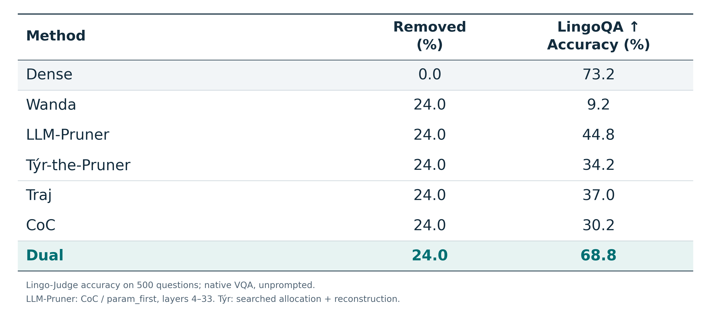
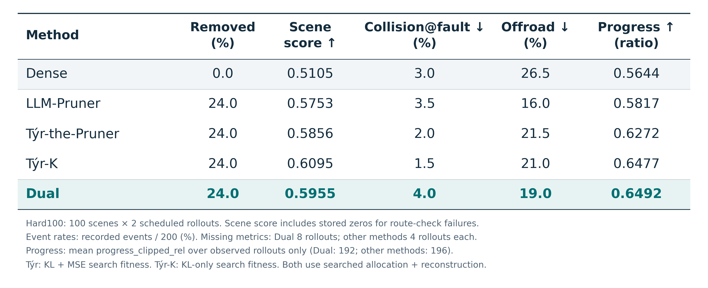
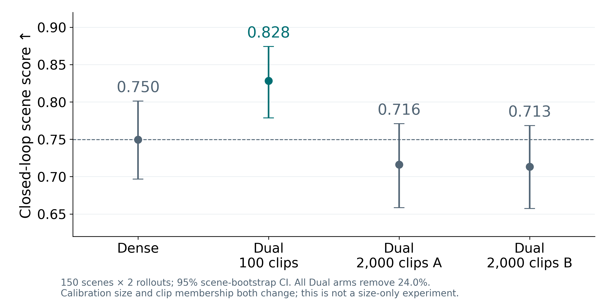
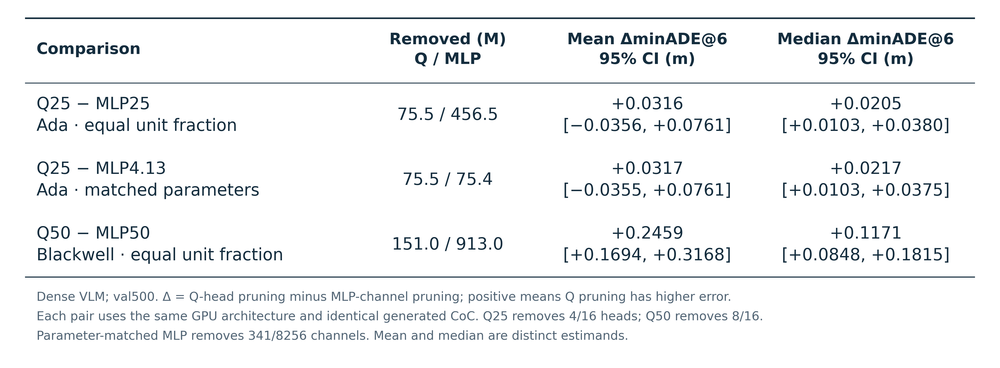
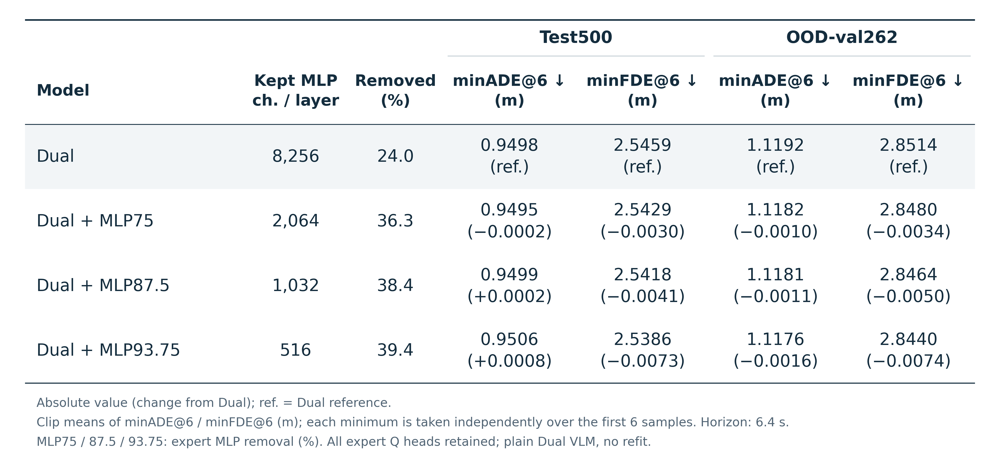
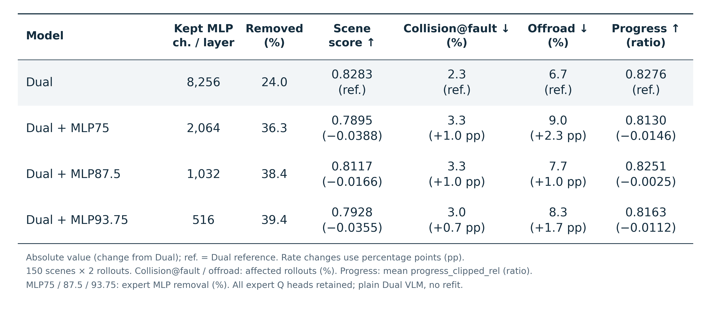

# Dual objective / expert MLP pruning 미팅 구성

발표 15분 + 질의응답. 성능 표를 평가별로 나누어 본문은 11장으로 구성한다. 실험 수행 순서보다
**두 목적의 중요도 차이 → dual 선택 규칙 → 세 평가에서의 결과 → expert의 추가 압축 → 남은 검증**을 따른다.
분석 그림 8개의 PNG·PDF·SVG도 `ppt-fig/`에 모았으며,
[그림별 역할과 발표 문장](../ppt-fig/analysis_figures.md)을 별도로 정리했다.

핵심 메시지는 두 가지다.

1. VLM의 trajectory와 CoC 중요도는 특히 깊은 레이어에서 서로 다른 구조를 선택한다.
   Dual은 이를 함께 반영하며, 현재 calibration에서 단일 목적보다 주행·VQA 성능을 함께 보존한다.
2. Expert MLP는 Q head보다 open-loop 오차 증가가 작은 압축 대상이다.
   그러나 작은 open-loop 변화만으로 closed-loop 성능 보존을 결론 낼 수는 없다.

## 1. 15분 발표 순서

| 장 | 시간 | 슬라이드 제목 / 전달할 주장 | 보여줄 자료 |
|---|---:|---|---|
| 1 | 1:00 | 주행과 reasoning을 함께 고려하는 구조적 압축 | VLM → CoC·KV → trajectory expert 구조와 두 압축 위치. 평가 세 축 소개 |
| 2 | 1:30 | 두 objective가 중요하게 보는 깊이가 다르다 | Q-head / MLP layer importance 그래프 2개 |
| 3 | 1:30 | 같은 레이어에서도 중요도 순위와 유지집합이 다르다 | Spearman + kept overlap. 하단에 dual 수식 하나 |
| 4 | 0:45 | Open-loop: 두 데이터셋의 궤적 오차 | Test500·OOD-val262 × minADE@6·minFDE@6 |
| 5 | 1:00 | Closed-loop: 점수와 실제 실패 양상 | Scene score·collision@fault·offroad·progress |
| 6 | 0:45 | LingoQA: 궤적 오차와 별도로 VQA 성능을 확인 | Lingo-Judge accuracy. 앞 두 표와 같은 방법 순서 |
| 7 | 1:30 | 현재 closed-loop 이점은 calibration에 민감하다 | Dense, calib100, calib2000 A/B의 closed-loop 점수와 CI |
| 8 | 1:30 | Expert MLP는 step 간 중요도 순위가 더 안정적이다 | Q / MLP step heatmap. Raw mass curve는 공간이 허용되면 오른쪽에 배치 |
| 9 | 1:30 | 실제 축별 pruning에서도 MLP의 open-loop 비용이 작다 | Expert Q-head vs MLP 비교표. 같은 비율·같은 파라미터 수 대조 |
| 10 | 2:30 | 추가 MLP 압축의 open-loop 변화와 closed-loop 변화는 다르다 | Dual + expert MLP 75 / 87.5 / 93.75% 결과표 |
| 11 | 1:30 | 확인한 것과 다음에 결정할 것 | Dual의 calibration 재현성, 목표 압축률과 허용 closed-loop 손실 |
| 합계 | **15:00** | 질의응답은 별도 | |

### 2장: layer importance

- [Q-head depth](../figures/fig1_depth_q_head.pdf), [MLP depth](../figures/fig1_depth_mlp.pdf).
- 발표 문장: “Trajectory와 CoC가 중요하게 보는 깊이가 일치하지 않습니다.
  한 목적의 점수만으로 전체 구조를 선택하기 어려울 수 있습니다.”
- Q peak는 trajectory 19 / CoC 24, MLP는 18 / 27이다. 레이어 인덱스는 0부터 시작한다.
- **각 곡선을 자기 최댓값으로 나눈 그림**이다. 절대 gradient 크기나 목적 간 loss 비중을 비교하지 않는다.
- 이 그림은 깊이별 분포를 설명한다. 실제 dual은 레이어별 예산을 고정하고 내부 구조를 선택한다.

### 3장: 순위와 실제 선택의 차이

- [Spearman](../figures/fig1_rank_agreement.pdf), [kept overlap](../figures/fig1_kept_overlap.pdf).
- 앞 그림은 레이어 내 전체 구조의 순위 관계, 뒤 그림은 **고정 예산에서 유지하는 구조의 겹침**이다.
  따라서 같은 내용을 반복하는 그림이 아니다.
- 레이어 22–34의 평균 overlap은 Q 67.6%, MLP 68.8%다.
  독립 무작위 선택의 기대 overlap은 각각 약 59.4%, 60.1%다.
- “완전히 분리된 구조”보다 “상당 부분 공유하면서도 서로 다른 구조를 요구한다”가 정확하다.
- Overlap은 `|K_traj ∩ K_CoC| / k`다. Jaccard나 모델 전체의 parameter-weighted overlap이 아니다.
  Q head와 MLP channel을 각각 표시한다. Constant score인 마지막 레이어는 제외한다.

슬라이드 하단 수식:

\[
I^{\mathrm{dual}}_{\ell,u}
=\max\{\operatorname{rank}_{u}(I^{\mathrm{traj}}_{\ell,u}),
         \operatorname{rank}_{u}(I^{\mathrm{CoC}}_{\ell,u})\}.
\]

큰 값이 높은 중요도를 뜻하도록 각 layer·axis 내부에서 rank를 계산하고, 주어진 개수만큼 유지한다.
**두 top-k 집합을 그대로 합집합으로 남기는 규칙은 아니다.** Overlap 자체가 성능 향상의 증명도 아니다.
성능 근거는 다음 장의 비교표로 연결한다.

## 2. 주 비교표 — 4·5·6장

본문에는 open-loop, closed-loop, LingoQA를 각각 독립된 표로 보여준다.
방법 순서와 강조색은 세 표에서 동일하게 유지한다. Dense + 요청한 6개 방법을 모두 포함한다.
Open-loop·closed-loop 표에는 `Dual + MLP93.75` 행을 추가하여 전체 39.4% 압축 결과도
함께 보여준다. 이 행은 주 비교 24%와 예산이 다른 추가 압축 결과로 설명한다.
전체 수치를 한 번에 확인하는 [통합 표](../ppt-fig/table_01_main_results.png)와
val500까지 포함한 [전체 split 표](../ppt-fig/table_04_main_all_splits.png)는 질의응답용으로 둔다.

**4장 — Open-loop:** Test500·OOD-val262 각각 minADE@6와 minFDE@6의 평균을 표시한다.



**5장 — Closed-loop:** Scene score와 세부 지표를 함께 표시한다.



Collision@fault와 offroad는 전체 300 rollouts 중 해당 사건이 발생한 비율(%)이다.
한 rollout 안에서의 사건 횟수나 timestep 비율이 아니다.
Progress는 기존 보고서와 같은 `progress_clipped_rel`의 평균이며, 전체 GT 경로에 대한
진행 비율이다. 단위는 ratio이고 `progress_rel` 또는 성공 rollout만의 평균과 구분한다.
Dense·모든 방법의 동일한 300 rollouts에서 누락 없이 집계했다.

**6장 — LingoQA:** 동일한 500 questions에 대한 Lingo-Judge accuracy를 표시한다.



각 표의 편집 가능한 수치는 같은 이름의 CSV에 저장한다.
사용자 요청으로 모든 발표 표의 LLM-Pruner Removed 표시는 24.0%로 통일했다.
아래 재현 설명과 원본 JSON에는 실제 체크포인트의 제거량을 보존한다.

Dual 행의 색상·굵기는 발표 대상 강조다. 모든 비교에서 통계적으로 유의한 최고라는 표시는 아니다.

표 설명은 다음 세 비교에 집중한다.

1. **Dual vs Traj / CoC:** 같은 구조·예산에서 목적 결합의 효과를 확인하는 대조다.
   Dual은 두 단일 목적보다 세 평가의 점추정치가 모두 좋다. CoC loss 기반 선택이
   곧 LingoQA 보존을 뜻하지 않는다는 점도 보인다.
2. **Dual vs Týr:** test minADE는 0.9498 / 0.9503으로 가깝지만 LingoQA는 68.8 / 34.2다.
   “궤적 오차만 보면 드러나지 않는 VQA 성능 차이”를 설명하기 좋다.
   Val500에서는 Týr가 더 낮은 오차를 보이므로 “모든 split에서 dual이 최고”라고 말하지 않는다.
3. **Dual vs LLM-Pruner:** closed-loop 점추정치는 0.8283 / 0.8105이나,
   paired Δscore의 95% CI는 **+0.0178 [−0.0289, +0.0657]**이다.
   Closed-loop 우월성이 확립됐다고 말하지 않는다. Open-loop·LingoQA 차이와 예산·범위 차이를 함께 설명한다.

Dense 대비로는 dual의 open-loop 오차와 LingoQA 점추정치가 나빠진다.
따라서 “원본 성능을 모두 개선”보다 “현재 압축 예산에서 여러 능력을 함께 고려”가 맞는 주장이다.
LingoQA는 native VQA의 Lingo-Judge accuracy다. CoC self-NLL이나 실제 reasoning 과정의
정확도를 직접 측정한 지표로 바꾸어 설명하지 않는다.

### 행 이름과 평가 조건

- **LLM-Pruner:** `lp_r50`, `coc_param_first`, layers 4–33, layer당 Q 16개·MLP 6,144개 제거.
  제거량 2,768,240,640개, 전체의 24.9874%. 원 논문의 모든 설정·회복 학습까지 같은 조건이라는 의미는 아니다.
- **Týr-the-Pruner:** `slim_tyr_u40_r`, searched allocation + reconstruction.
  Selection-only나 uniform variant의 점수를 같은 행에 섞지 않았다.
- **Dual / Traj / CoC / Wanda:** 각 `slim_*_u40_v2`, 제거량 2,657,452,032개,
  전체의 23.9874%. Q 19/32·MLP 7,390/12,288 유지. Expert·KV는 유지한다.
- 따라서 주 표는 방법 비교이며, **LLM-Pruner까지 정확히 동일 예산인 one-factor ablation은 아니다.**
  Wanda도 이 저장소의 구조 단위 적용 결과로 소개한다.
- Open-loop는 rollout condition, clip별 6개 샘플 중 최소 ADE·FDE의 **clip 평균**이다.
  ADE와 FDE의 최소값은 각각 독립적으로 선택하므로 같은 trajectory sample일 필요는 없다.
  `@6`은 샘플 개수이고 시간 지평은 6.4초다. 저장된 `minADE_rollout`(@8)을 그대로 사용하지 않았다.
- Closed-loop는 `public_2601`의 동일 150 scenes × 2 rollouts, rollout → scene 평균 → 전체 평균이다.
  다른 난도인 hard100 점수를 이 열에 섞지 않는다.
- LingoQA는 동일 500 questions의 native VQA, unprompted 조건이다.
  짧은 답변을 유도한 concise 조건 및 CoC-judge 조건을 섞지 않는다.
- Open-loop의 Ada, seed 42, model revision을 확인했다. 과거 closed-loop 실행에서는
  Dual 일부 shard의 OMP 설정이 다른 arm과 달랐다는 기록이 있으므로 완전한 실행 환경 일치를 주장하지 않는다.

질의응답용 LLM-Pruner dual variant는 `lp_r50_dual`이다. 동일 25.0% 제거에서
test minADE@6 **1.2649**, closed-loop **0.8162**, LingoQA **61.8%**다.
주 표의 CoC variant와 구분한다. 이 결과도 dual signal의 효과를 설명하는 보충 비교가 된다.

### Hard100 — 별도 평가 표



Dense, LLM-Pruner, Týr-the-Pruner, Týr-K, Dual의 완료된 결과를 포함했다.
Wanda·Traj·CoC·Dual + expert MLP의 완료된 Hard100 결과는 확인되지 않았다.
Týr-K는 `slim_tyrK`이며 탐색 적합도를 KL만 사용한 변형이다. 주 표의 Týr는
`slim_tyr_u40_r`로 KL + trajectory MSE를 사용하므로 두 행을 구분한다.
Hard100의 scene ID는 기존 150-scene 평가와 겹치지 않는다.

기존 100 scenes × 2 rollouts 집계에서 scene score는 Dense 0.5105, LLM-Pruner 0.5753,
Týr 0.5856, Týr-K 0.6095, Dual 0.5955다.
Dual−Dense의 paired mean Δscore는 **+0.0850 [0.0297, 0.1425]**다.
Dual−Týr는 **+0.0099 [−0.0483, +0.0686]**, Dual−LLM-Pruner는
**+0.0202 [−0.0592, +0.0985]**, Dual−Týr-K는 **−0.0141 [−0.0769, +0.0488]**로
각 CI가 0을 포함한다. 압축 방법 사이의 우열이 확립됐다고 설명하지 않는다.

**누락 처리:** 경로 sanity check 실패로 Dual 8개, 나머지 방법 각각 4개 rollout의
collision·offroad·progress가 없다. Scene score는 이 실패에 저장된 0점도 포함한다.
위 표의 collision·offroad는 과거 보고서의 `기록된 사건 수 / 예정된 200 rollouts`를 유지한다.
이는 누락된 rollout에서 무사고를 관측했다는 의미가 아니다. Progress는 유효 관측만 평균하여
Dual 192개, 나머지 196개를 사용한다. 두 비율의 차이를 이미지 각주에도 명시했다.

동일 관측 집합의 비교를 위한 [공통 96-scene 표](../ppt-fig/table_06_hard100_common_valid.png)도
제공한다. 이 표는 Dense·LLM-Pruner·Týr·Dual의 네 행으로 구성한다.
어느 방법에서든 세부 지표가 없는 4 scenes를 제외하고, 모든 방법·모든 열을
동일한 96 scenes × 2 rollouts로 집계했다. 이 표에서 Dual의 score / collision@fault /
offroad / progress는 **0.6203 / 4.2% / 19.8% / 0.6492**다.
100-scene 결과와 공통 96-scene 결과를 같은 모집단의 수치처럼 섞지 않는다.

15분 본문은 유지하고 이 두 표를 질의응답용으로 준비한다. 본문에서 다룬다면 5장 뒤에
짧게 보여주면서 “난도가 높은 집합에서도 Dense 대비 score는 높지만, 방법 간 우열과
충돌 감소는 별도로 확인해야 합니다”로 설명한다.

## 3. Calibration의 한계 — 7장



발표 문장: “앞 표의 closed-loop 이점은 현재 calib100에서 관찰한 결과입니다.
서로 다른 2,000-clip calibration에서는 같은 dual 규칙과 예산으로 0.716 / 0.713이 나왔습니다.
현재 가장 중요한 후속 검증은 이 이점의 calibration 재현성입니다.”

Dense 0.750, calib100 0.828, calib2000 A 0.716, B 0.713이다.
**샘플 수와 clip 구성 둘 다 바뀌므로**, “데이터가 많으면 나빠진다”라는 인과 결론은 내리지 않는다.
또한 mask가 안정적으로 재현된다는 것과 주행 점수가 좋다는 것은 서로 다른 검증이다.
이 결과는 핵심 결론의 적용 범위를 바꾸므로 본문에 짧게 포함한다.

## 4. Expert MLP 분석과 실험 — 8·9장

8장 자료: [Q step heatmap](../figures/fig2_steps_q_head.pdf),
[MLP step heatmap](../figures/fig2_steps_mlp.pdf), [raw mass curve](../figures/fig2_mass_curve.pdf).

“Step 간 중요도 순위의 평균 Spearman은 Q 0.668, MLP 0.874입니다.
MLP에는 raw importance가 작은 채널이 많이 관찰되어, MLP 중심 압축을 실험했습니다.”

Heatmap 값은 **각 layer 내부에서 step pair의 Spearman을 구하고 layer 평균**한 것이다.
Noise가 step마다 다르므로 순수한 시간 변화만 분리한 실험은 아니다.
Mass curve의 nominal 90% 위치에서 raw mass는 Q 68.5%, MLP 1.8%지만,
Q는 이산 head 수 때문에 실제 14/16=87.5% 제거 위치다.
이 곡선은 raw step score 합의 분포이며 아래 최종 `znorm` 점수의 누적 질량이 아니다.
안정성·집중도가 pruning 내성을 일으킨다는 인과 증명으로 제시하지 않는다.

최종 expert MLP 점수는 다음 순서로 설명한다.

\[
A_{s,\ell,u}=\frac1N\sum_c\left|\frac{\partial L_{c,s}}{\partial g_{\ell,u}}\right|,
\qquad I^{\mathrm{expert}}_{\ell,u}
=\frac1{10}\sum_{s=0}^{9}\operatorname{zscore}_{u}(A_{s,\ell,u}).
\]

Clip 평균 → 각 step·layer 내부 channel z-score → step 평균 → layer별 하위 채널 제거다.
Expert 기준에는 CoC를 결합하지 않는다. Dense 모델에서 측정한 점수를 재사용한다.
Gate는 scalar이며, gate gradient 안에 activation과 그 gradient의 contraction이 이미 들어 있다.

9장 자료:



Q25와 MLP25는 같은 제거 비율이지만 각각 75.5M / 456.5M을 제거한다.
파라미터 수를 맞춘 비교는 Q25와 MLP341 channels(약 4.13%, 75.4M)이다.
50% 비교에서는 Q−MLP의 평균 ΔminADE가 **+0.2459 [0.1694, 0.3168] m**다.
25% 대조는 paired median이 양수지만 평균 CI는 0을 포함한다. 평균·중앙값을 섞어 유의성을 설명하지 않는다.
비교별로 같은 GPU와 같은 생성 CoC를 사용하며, Ada 25%와 Blackwell 50%를 하나의 연속 곡선으로 잇지 않는다.

## 5. Dual에 expert MLP를 추가한 결과 — 10장





두 표를 순서대로 설명한다. [통합 표](../ppt-fig/table_03_dual_expert_mlp.png)도 갱신했다.
Test500·OOD-val262의 minADE@6와 minFDE@6, closed-loop의 scene score·collision@fault·
offroad·progress를 모두 포함한다. 성능 셀은 **절대값 (plain Dual 대비 부호 있는 차이)**다.
괄호는 상대 변화율이나 CI가 아니며, 충돌·offroad의 차이는 percentage points(pp)다.
차이는 반올림 전 원래 평균끼리 계산하므로 표시된 절대값끼리 뺀 결과와 끝자리가 다를 수 있다.

이 표의 VLM parent는 **plain dual**이다. `dualrwl`의 refit 효과를 포함하지 않는다.
75 / 87.5 / 93.75%는 expert MLP 내부의 제거율이며, 모델 전체 제거율은 36.3 / 38.4 / 39.4%다.
Expert Q heads는 전부 유지하며, 유지 MLP 집합은 516 ⊂ 1,032 ⊂ 2,064로 중첩된다.

발표 문장: “모델 전체의 약 39.4%까지 제거했을 때 test minADE는 0.9506 m로
Dual 대비 +0.0008 m, minFDE는 2.5386 m로 −0.0073 m입니다.
그러나 closed-loop scene score는 0.7928로 −0.0355입니다.
추가 압축 가능성은 크지만, open-loop 변화가 작다는 이유만으로 주행 성능까지 보존됐다고 말할 수 없습니다.”

- 93.75% 제거의 OOD-val262 minADE / minFDE는 1.1176 / 2.8440 m이며,
  Dual 대비 −0.0016 / −0.0074 m다. Test·OOD minFDE의 모든 평균 차이 CI는 0을 포함한다.
- Closed-loop에서는 세 제거율 모두 Dual보다 collision@fault·offroad의 점추정치가 높고
  progress는 낮다. 93.75% 제거에서 각각 3.0% (+0.7 pp), 8.3% (+1.7 pp),
  0.8163 (−0.0112)다. Scene score만으로 숨겨지던 세부 변화도 함께 제시한다.
- 세 split·세 제거율의 평균 ΔminADE CI는 모두 0을 포함한다. 최대 평균 변화는 val의 +0.0033 m다.
  이는 동등성 검정이 아니며 모든 지표가 동일하다는 의미도 아니다. Val minFDE에서는 양의 차이가 관찰됐다.
- Closed-loop 점추정치는 모두 parent dual보다 낮다. 75%·93.75%의 평균 CI는 0을 배제하고,
  87.5%는 포함한다. 저장된 Wilcoxon 결과와 평균 CI는 다른 통계량을 다루므로 구분한다.
- 압축률 증가에 따라 closed-loop 손실이 단조롭게 증가하지 않는다. 87.5%가 확정된 최적점이거나
  “첫 절단에서만 손해가 생긴다”는 계단 형태까지 입증된 것은 아니다.
- Dense 대비 점수가 높다는 것과, 추가 MLP pruning이 parent dual보다 성능을 보존한다는 것은 다르다.
- 추론 속도·메모리 개선은 별도 측정이 필요하다. Parameter 제거율을 latency 개선율로 바꾸지 않는다.

95% CI는 표의 괄호에서 제외하고 `meeting_table_data.json`의 `composition`에 보존했다.
`open_delta`는 minADE, `open_fde_delta`는 minFDE, `closed_delta`는 scene score다.
Clip 5,000회 / scene 10,000회 paired percentile bootstrap, seed 0을 사용한다.

## 6. 마무리와 질의응답

마지막 슬라이드는 다음 세 문장으로 충분하다.

1. **Dual:** 서로 다른 목적의 구조 중요도를 결합할 근거가 있고, 현재 calibration의 세 평가에서
   단일 목적 대비 좋은 절충을 보인다. Closed-loop 이점의 calibration 재현성은 남아 있다.
2. **Expert MLP:** 추가 압축에 따른 open-loop 변화는 작지만, closed-loop 보존을 별도로 검증해야 한다.
3. **다음 결정:** 목표 parameter budget과 허용 closed-loop 손실을 먼저 정하고,
   calibration draw를 바꾸어 후보 압축률을 재검증한다.

본문에서 제외하고 준비할 자료:

| 자료 | 질문에 답하는 역할 |
|---|---|
| 전체 split 표 / LLM-Pruner dual variant | 특정 split이나 baseline variant를 유리하게 고른 것은 아닌가 |
| Calibration·target·gate·normalization 상세 | 중요도와 그래프를 어떻게 재현하는가 |
| Rank-max / 다른 집계 규칙 비교 | Max 선택의 근거는 무엇인가. 정규화도 다른 비교는 연산자 효과로 단정하지 않음 |
| Hard100 및 collision_any·경로 이탈 등 추가 세부 지표 | 주 평가 suite 밖에서도 관계가 유지되는가 |
| Dualrwl + expert MLP ladder | Refit된 VLM에서도 추가 MLP 압축이 가능한가. Plain dual 표와 parent를 구분 |
| 코드 audit / constant 마지막 layer 대조 | 기존 실험의 구현 이슈가 무엇이었고 해석에 어떤 제한이 있는가 |

`dualrwl`을 본문 대표로 쓰지 않은 이유는 이번 핵심 질문을 plain dual + MLP의 직접 대조로
설명할 수 있기 때문이다. 별도로 제시할 경우 weighted-Hessian의 실제 sample weighting과
일부 refit state 누락에 관한 [기존 audit](../reports/evaluation/2026-09-10_dual-code-audit.md)을 반영한다.
Original dual의 마지막 layer constant-score tie 처리도 대조 실험과 함께 설명하고,
“코드 문제가 전혀 없는 모든 실험”으로 묶어서 소개하지 않는다.

## 7. 파일과 재현

- 표 이미지·벡터·CSV: [ppt-fig](../ppt-fig/README.md).
- 숫자 원본·누락 관측 목록·읽은 140개 데이터/그림 파일의 SHA-256:
  [meeting_table_data.json](../ppt-fig/meeting_table_data.json).
- 분석 figure 목록·발표 문장: [analysis_figures.md](../ppt-fig/analysis_figures.md).
- 생성 코드: [make_meeting_tables.py](../experiments/paper/make_meeting_tables.py).
- 기존 그래프의 상세 정의: [figure 재현 설명](2026-09-09_figure-reproducibility.md).
- Expert 점수 상세: [최종 중요도 설명](2026-09-09_dualrwl-expert-mlp-importance.md).

```bash
MPLCONFIGDIR=/tmp/alpamayo-mpl .venv/bin/python experiments/paper/make_meeting_tables.py
```

새 GPU 실험 없이 저장된 결과를 재집계했다. Main/MLP 표의 open-loop는 sample arrays,
closed-loop는 rollout rows에서 계산했고, LingoQA는 해당 exp-id의 저장된 judge 집계를 사용했다.
Expert axis의 paired 통계와 calibration CI는 기존 분석 JSON에서 읽었다.
CI 재계산의 seed·반복 수·clip 정렬 규칙이 달라 일부 과거 보고서와 끝자리 차이가 날 수 있다.

표 PNG는 300 dpi, PDF는 TrueType font 포함, SVG는 글자를 path로 저장한다.
기존 논문 그래프는 슬라이드에서 축 글씨가 작아지지 않도록 한 장에 2개를 기본으로 배치하고,
실험 경로와 긴 캡션은 발표자 노트에 둔다. 축·단위·평가 표본 수·비교 조건은 유지한다.
