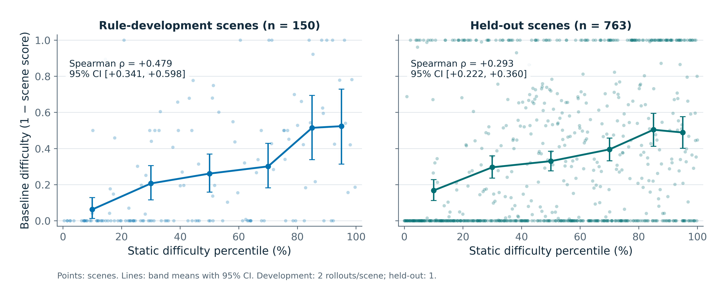
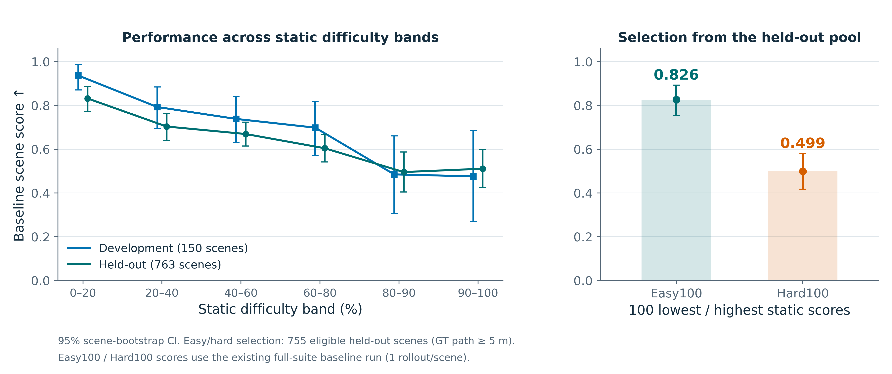
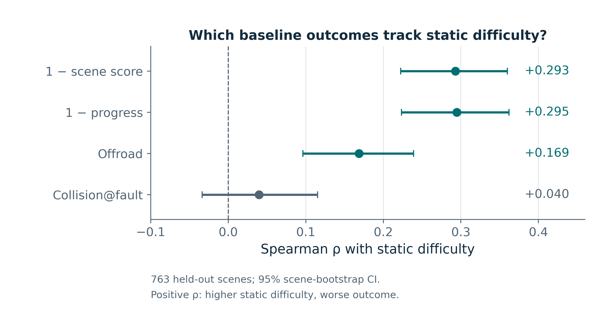
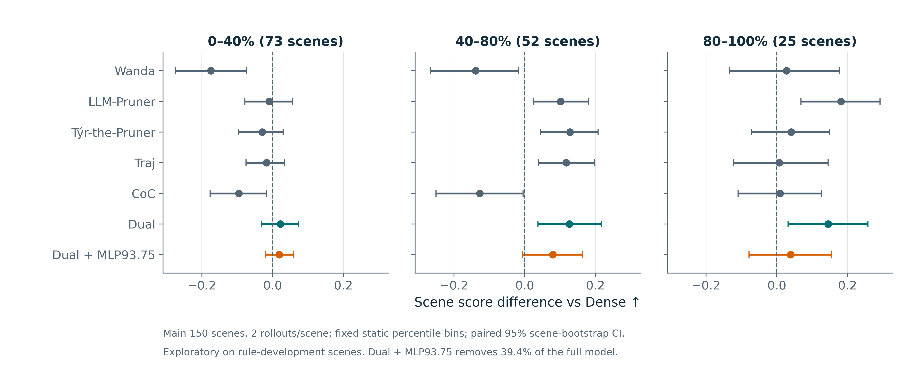

# Closed-loop 난이도 분석: 발표 문장과 재현 정보

기존 [2026-09-03 분석 보고서](../reports/evaluation/2026-09-03_difficulty-stratified-arms.html)의
원본 데이터를 다시 집계했다. **Static difficulty가 높을수록 baseline의 scene score가 낮아지는
관계가, 난이도 피처 선택에 사용하지 않은 763개 장면에서도 확인된다.**
새 모델 추론이나 closed-loop 평가를 실행한 결과는 아니다.

## 발표에서 사용할 그림

| 그림 | 발표 메시지 | 권장 위치 |
|---|---|---|
| [상관관계](fig_07_static_difficulty_correlation.png) | Static difficulty와 baseline difficulty는 미사용 장면에서도 양의 상관을 보인다 | Hard100 평가 동기 |
| [구간별 검증과 Easy100/Hard100](fig_08_static_difficulty_validation.png) | 모델 출력 없이 선택한 Hard100의 실제 baseline 점수가 더 낮다 | 위 그림과 택일하거나 다음 장 |
| [지표별 상관](fig_09_static_difficulty_metrics.png) | Progress 저하와 offroad를 어느 정도 반영하지만, 과실 충돌과의 관계는 약하다 | 질의응답 |
| [Pruning 방법별 난이도 분석](fig_10_pruning_by_static_difficulty.png) | 같은 static 난이도 구간에서 Dense 대비 성능 차이를 비교한다 | 본문 보충 또는 질의응답 |

각 그림은 같은 이름의 PDF·SVG도 제공한다. 흰 배경, DejaVu Sans, PNG 400 dpi,
PDF 내장 TrueType font, SVG glyph path를 사용했다.

15분 발표라면 **구간별 검증 그림 한 장을 Hard100 결과표 앞에** 넣는 구성이 간결하다.
상관계수 자체를 강조하려면 첫 번째 그림을 사용하고 나머지는 보충 슬라이드에 둔다.

발표 문장:

> “기존 closed-loop 평가를 보완하기 위해 모델 출력 없이 계산할 수 있는 static difficulty를
> 사용했습니다. GT 평균 속도와 시작·끝 방향 변화로 정의한 이 점수는, 규칙을 정할 때
> 사용하지 않은 763개 장면에서도 baseline 난이도와 양의 상관을 보였습니다.
> 이 기준만으로 고른 Easy100과 Hard100의 baseline scene score는 각각 0.826과 0.499였습니다.
> 따라서 Hard100은 baseline이 실제로 더 어려워하는 장면에서 pruning 결과를 확인하는
> 추가 평가로 사용했습니다.”

## 두 난이도의 정확한 정의

Static difficulty는 `public_2601`의 913 scenes 전체에서 다음처럼 계산한다.

\[
H_i=z(v_{\mathrm{mean},i})+z(\Delta\psi_i),\qquad
z(x_i)=\frac{x_i-\mu_{913}}{\sigma_{913}+10^{-9}}.
\]

- `v_mean`: GT ego 위치의 연속 샘플 간 XY 이동 거리를 시간 차이로 나눈 속도의 산술평균(m/s).
- `yaw_total_deg`: unwrap한 heading의 **시작·끝 차이 절댓값**(degree).
  즉, `degrees(abs(heading[-1] - heading[0]))`이다.
- 표준편차는 `ddof=0`. 전체 GT 궤적에서 오프라인으로 추출한 장면 특성이다.
  차량이 현재 시점에 관측한 정보만으로 계산하는 온라인 난이도 예측기는 아니다.
- 정규화 평균/표준편차: 속도 `9.968026 / 7.030849`, 방향 변화 `16.136282 / 28.043051`.

**기존 문서의 “누적 선회각”이라는 표현을 수정해야 한다.** 현재 코드와 당시 보존된 추출 코드
모두 `yaw_total_deg`를 시작·끝 방향 차이로 계산한다. 방향 변화량 절댓값을 매 구간 합한
별도 변수 `yaw_abs_deg`가 있지만 기존 hard score에는 사용하지 않았다.
이번 그림에서도 기존 선택 기준과 실험을 재현하기 위해 계산 자체는 유지했다.

Baseline difficulty는 읽기 편하도록 다음처럼 정의했다.

\[
D_i=1-S_i^{\mathrm{baseline}}.
\]

`S`는 저장된 closed-loop scene score다. 원래 보고서는 `H`와 `S`의 음의 상관을 보고했고,
첫 번째 그림은 `H`와 `1-S`의 양의 상관을 표시한다. **부호만 반대이며 같은 관계**다.

저장된 score 기준은 두 baseline run에서 동일하다.

- `collision_at_fault == 0`, `offroad == 0` 조건을 통과한 뒤 progress score를 반영한다.
- `progress_score = min(clamp(progress_clipped_rel, 0, 1) / 0.8, 1)`.
- GT 이동 거리 5 m 미만이면 progress score는 1로 대체된다. 충돌·offroad 조건은 별도다.

## 1. Static difficulty와 baseline difficulty의 관계



| 분석 집합 | Scenes | Rollouts/scene | Spearman ρ: H vs 1−S | 95% CI |
|---|---:|---:|---:|---|
| 규칙 선택에 사용한 기존 평가 장면 | 150 | 2 | +0.479 | [+0.341, +0.598] |
| 규칙 선택에 사용하지 않은 장면 | 763 | 1 | +0.293 | [+0.222, +0.360] |

763 scenes의 p-value는 약 `1.45e-16`이다. 개별 장면의 성패를 정확히 예측하는 강한 상관으로
설명하기보다는, **더 어려운 평가 장면을 선별하는 데 유용한 경향**으로 설명한다.

점 하나는 scene 하나다. 150 scenes에서는 2회 rollout의 score를 먼저 평균한다.
가로축은 전체 913 scenes에서의 static score 순위 백분위이며,
`100 × (average_rank(H) − 1) / 912`로 계산했다. 이 순위 변환은 Spearman 값을 바꾸지 않는다.
선은 static score의 백분위 구간별 평균이고 오차 막대는 95% CI다.

두 패널의 baseline 결과는 서로 다른 기존 실행에서 왔으며 rollout 수도 다르다.
150 scenes는 피처 선택에도 사용됐으므로 763 scenes의 상관을 주된 검증 결과로 사용한다.
원본 score가 0 또는 1인 경우가 많아 산점도에 수평으로 모이는 점은 정상적인 점수 분포다.

## 2. 난이도 구간별 성능과 선별 검증



백분위 경계는 913 scenes의 `H`에 `np.percentile`을 적용한다. 구간은 왼쪽 경계를 포함하고,
마지막 구간만 오른쪽 최댓값도 포함한다. 표의 값은 반올림한 scene score 평균이다.

| Static 백분위 구간 | 기존 150 내 n | 기존 평균 | 미사용 763 내 n | 미사용 평균 |
|---|---:|---:|---:|---:|
| 0–20% | 36 | 0.937 | 147 | 0.832 |
| 20–40% | 37 | 0.793 | 145 | 0.704 |
| 40–60% | 25 | 0.739 | 158 | 0.670 |
| 60–80% | 27 | 0.699 | 155 | 0.605 |
| 80–90% | 13 | 0.485 | 78 | 0.496 |
| 90–100% | 12 | 0.476 | 80 | 0.511 |

상위 두 구간의 평균은 약 0.5로 비슷하다. 이를 모든 상위 구간의 난이도가 동일하다는
동등성 증명이나 더 높은 난이도의 점수가 내려갈 수 없다는 일반 법칙으로 해석하지 않는다.

Easy100과 Hard100은 미사용 763 scenes에서 GT 주행 거리 5 m 미만 8개를 제외한
755 scenes를 static score로 정렬해 각각 하위·상위 100개를 선택했다.
Baseline 출력은 선택에 사용하지 않는다.

| 선택 집합 | Baseline scene score | 95% CI |
|---|---:|---|
| Easy100 | 0.826 | [0.754, 0.893] |
| Hard100 | 0.499 | [0.417, 0.581] |

Hard100−Easy100 평균 차이는 −0.327, 기존 Mann–Whitney 검정 p ≈ `5.42e-10`이다.
Hard100 ID 집합이 실제 `public_2601_hard100` suite CSV와 100/100 일치함을 확인했다.

**이 0.499는 913-scene baseline 실행에서 가져온 1-rollout 평균이다.**
별도로 재실행한 Hard100 2-rollout 표의 0.5105 또는 공통 유효 96-scene 표의 0.5317과
평가 실행·장면 수·집계가 다르다. 서로 바꾸어 적지 않는다.

## 3. 어떤 지표의 어려움을 반영하는가



미사용 763 scenes, scene당 1 rollout의 원본 지표로 다시 계산했다.
그래프의 지표들은 모두 값이 클수록 더 나쁜 방향이다.

| Baseline 측정값 | Static difficulty와의 ρ | 95% CI |
|---|---:|---|
| 1 − scene score | +0.293 | [+0.222, +0.360] |
| 1 − progress_clipped_rel | +0.295 | [+0.223, +0.362] |
| Offroad 발생 여부 | +0.169 | [+0.096, +0.239] |
| Collision@fault 발생 여부 | +0.040 | [−0.034, +0.115] |

Progress와 offroad에는 관련성이 관찰되지만, collision@fault의 상관은 작고 CI가 0을 포함한다.
따라서 **“충돌 위험이 높은 장면을 골랐다”는 설명은 이 분석이 뒷받침하지 않는다.**
상관이 확인되지 않았다는 것을 완전한 독립성의 증명으로 해석하지 않는다.

기존 보고서에는 과실 충돌 상관이 `+0.008`로 적혀 있다. 이번 763-scene 재집계값은
`+0.0396`이고, 913 scenes 전체에서도 `+0.0446`이었다. 기존 `+0.008`의 계산 대상을
확인하지 못했으므로 새 그림에는 확인된 763-scene 수치만 사용했다.

## 4. 난이도 구간 안에서 pruning 방법 비교



기존 주 비교 150 scenes를 **static** 백분위 0–40%, 40–80%, 80–100%로 나눈다.
장면 수는 각각 73, 52, 25이고 각 방법이 같은 장면을 사용한다.
오른쪽은 전체 suite의 상위 20%에 속하는 기존 25 scenes이며, 별도 Hard100과 구분한다.

Scene당 2회 rollout 평균끼리 `method − Dense`를 계산한 뒤 장면별 paired bootstrap을 적용한다.
세 패널에서 동일한 가로축 범위를 사용한다.

| Static 구간 | Dense 절대 점수 | Dual 절대 점수 | Dual−Dense [95% CI] | Dual + MLP93.75 절대 점수 |
|---|---:|---:|---|---:|
| 0–40% | 0.8642 | 0.8863 | +0.0221 [−0.0306, +0.0728] | 0.8830 |
| 40–80% | 0.7179 | 0.8444 | +0.1265 [+0.0375, +0.2160] | 0.7975 |
| 80–100% | 0.4808 | 0.6255 | +0.1447 [+0.0316, +0.2577] | 0.5198 |

발표 문장:

> “기존 150 scenes를 static 난이도로 나누면, Dual은 중간·높은 난이도 구간에서도
> Dense보다 높은 평균 scene score를 보입니다. Expert MLP를 93.75% 추가 제거한 모델에서는
> 특히 높은 난이도 구간의 점추정치가 낮아져, 전체 평균과 함께 어려운 장면도 볼 필요가 있습니다.”

이 분석은 피처 선택에 사용한 150 scenes 위의 탐색적 결과다. 다음을 구분한다.

- Baseline의 낮은 실측 점수로 장면을 고르고 같은 baseline 점수에 대한 개선량을 읽으면
  regression-to-the-mean이 생길 수 있다. 여기서는 static 구간을 사용했다.
  다만 static 피처 자체의 선택 편향까지 독립적으로 검증한 방법 비교는 아니다.
- CI는 각 방법의 **Dense 대비 차이**다. 서로 다른 방법이나 난이도 구간 사이의 차이에 대한
  검정이 아니다. 어려울수록 개선량이 유의하게 더 커진다는 interaction 검정도 하지 않았다.
- 높은 난이도 구간의 LLM-Pruner 평균은 0.6622로 Dual 0.6255보다 높다.
  모든 난이도에서 Dual이 모든 비교 방법보다 최고라는 결론을 내리지 않는다.
- `Dual + MLP93.75`는 plain Dual VLM에 expert MLP 93.75% 제거를 적용했다.
  전체 모델 제거율은 39.4%로, 24%인 plain Dual과 압축 예산이 다르다.

## 데이터와 재현

생성 코드: [make_difficulty_figures.py](../experiments/paper/make_difficulty_figures.py).

```bash
MPLCONFIGDIR=/tmp/alpamayo-mpl .venv/bin/python experiments/paper/make_difficulty_figures.py
```

주요 입력:

- Static features: `outputs/scene_difficulty/scene_feats_public2601.json`.
- 기존 집계 검증: `outputs/difficulty_strat/metrics.json`.
- Full-suite baseline: `/mnt/nvme1n1/ad_vla/results/sangoh/alpasim_runs/eval2601_a1_5/aggregate/results-summary.json`.
- 주 비교 baseline·pruned arms: `/home/cvlab21/project/chan/alpasim-runs/m2601_merged_*/aggregate/results-summary.json`.
- LLM-Pruner: `/mnt/nvme1n1/ad_vla/outputs/soowon/alpasim-runs/cl150_merged_lp_r50/aggregate/results-summary.json`.
- Hard100 ID 검증: `/home/cvlab21/project/chan/alpasim-runs/hard100/hard100_suite.csv`.

저장 산출물:

- [difficulty_analysis_data.json](difficulty_analysis_data.json): 수치, 정규화, 구간 경계,
  bootstrap 설정, 원본 및 생성 코드 SHA-256, easy/hard ID.
- [difficulty_scene_data.csv](difficulty_scene_data.csv): 913개 scene의 static feature·난이도·baseline 지표.
  150개는 기존 2-rollout 결과, 나머지 763개는 full-suite 1-rollout 결과이며 `population` 열로 구분한다.
- [difficulty_method_scene_data.csv](difficulty_method_scene_data.csv): 방법별 150 scenes의 paired score.
- [difficulty_method_summary.csv](difficulty_method_summary.csv): 방법×난이도 구간별 절대 점수·차이·CI.

모든 CI는 scene 단위 percentile bootstrap 10,000회, NumPy RNG seed 0, 95% 구간이다.
상관 CI는 장면의 `(H, outcome)` 쌍을 함께 복원추출하고 매번 동점을 포함한 순위를 다시 계산한다.
방법 비교에서는 각 장면의 차이를 복원추출한다. 여러 패널에 대한 동시 신뢰구간이나
calibration seed·모델 재학습 변동을 포함하는 구간은 아니다.

중복 rollout, scene 집합, rollout 수, 유한 지표, score 기준 동일성, 실제 Hard100 ID를 검증한다.
기존 보고서의 구간 평균·763-scene 상관·easy/hard 평균이 원본 재집계와 일치하는지도 확인한다.
이번에 읽은 결과에는 score·progress·offroad·collision@fault 누락이 없었다.
공유 `outputs/`·평가 디렉터리·모델은 변경하지 않는다.
